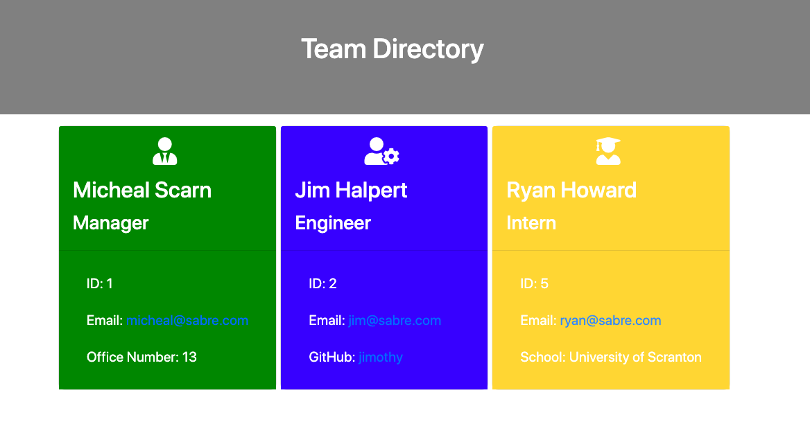

# Team_Generator_CLI 
 
### Description 

This node CLI tool generates HTML pages for your software team. From the CLI, input your team member's information and this tool will generate an html with individual cards for each member. See the video tutorial ***[here](https://sassypigeon.github.io/Team_Generator_CLI/)***.

### Table of Contents 
- [**Description**](#Description) 
- [**Installation**](#Installation) 
- [**Usage**](#Usage) 
- [**License**](#License) 
- [**Contributing**](#Contributing) 
- [**Tests**](#Tests) 
- [**Questions**](#Questions)
### Installation 
 After cloning the repo, run 'npm i' in the terminal and then run 'node app.js'. 
### Usage 

### License 
This project is covered under the MIT license. 
### Contributing 

### Tests 

### Questions 

For additional projects and materials, go to ***[github.com/sassypigeon](https://github.com/sassypigeon)***. 
For additional questions, email me at ***mitchellmunderwood@gmail.com***. 

### Images

